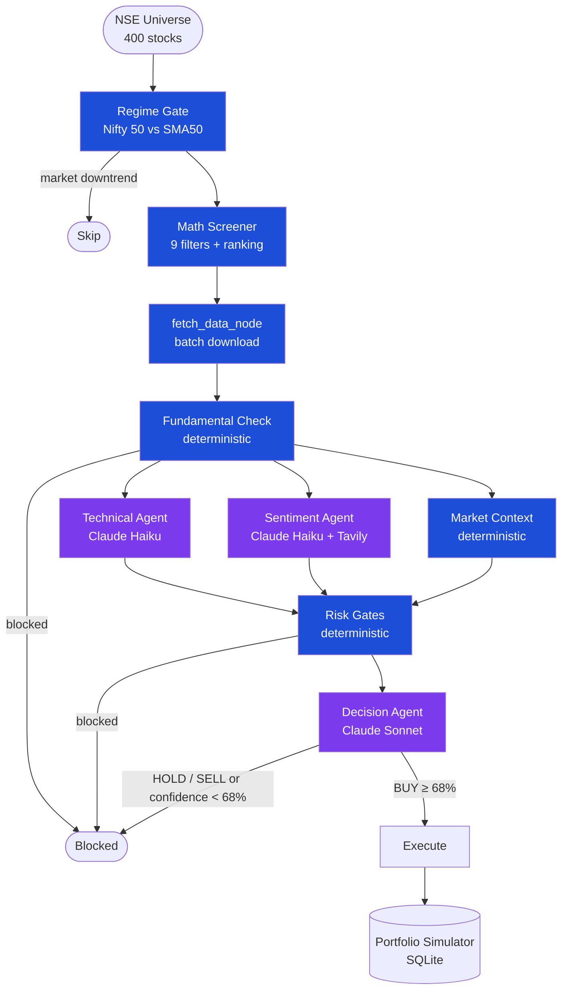

# NSETradeAgents

Multi-agent AI system for swing trading NSE smallcap and midcap stocks. Targets 1-4 week holds with ATR-based stops, a hybrid trailing stop for proven winners, and 18% take profit. Fully automated — morning discovery at 9:30 AM IST, 15-minute position monitoring during market hours.

---

## Architecture

```
NSE Universe (Smallcap 250 + Midcap 150 — 400 stocks)
        ↓
Regime Gate  (Nifty 50 vs SMA50 — skips all new entries if market in sustained downtrend)
        ↓
Math Screener  (9 filters: SMA trend, RSI 55-70, ATR >1.5%, volume >2× on up day, momentum >2%, liquidity >₹2Cr)
        ↓
fetch_data_node  (yfinance — single batch download before parallel fan-out)
        ↓
Fundamental Check  (deterministic — market cap, D/E ratio, ROE, no LLM)
        ↓  conditional: blocked if fails, else parallel fan-out
        ├── Technical Agent    Claude Haiku  — 20 indicators, structured output, temperature=0
        ├── Sentiment Agent    Claude Haiku  — ReAct loop → Tavily search → scoring, temperature=0
        │     └── Research Agent  create_agent + Tavily — sector-aware autonomous search
        └── Market Context     No LLM — Nifty 50 (day/5d/10d/20d trend, SMA20, India VIX), sector index, 52w position, divergence
        ↓  fan-in
Risk Agent       Deterministic — 4 hard gates + ATR-based position sizing (max 5 positions × 20%)
        ↓  conditional routing
Decision Agent   Claude Sonnet — 5-dimension rubric → labels → computed confidence score, temperature=0
        ↓  conditional routing (≥68% confidence; ≥80% to unlock 5th high-conviction slot)
Portfolio Simulator  SQLite — cash accounting, trailing stop management, realised + unrealised P&L
```

**Single-process deployment:** FastAPI (async event loop) + APScheduler (BackgroundScheduler threads) run in one uvicorn process. The scheduler fires jobs in background threads; FastAPI serves the dashboard concurrently.


*Purple = LLM nodes (Claude). Blue = deterministic.*
---

## Tech Stack

| Layer | Technology |
|---|---|
| Agent orchestration | LangGraph — parallel fan-out, typed state, conditional routing |
| LLM | Anthropic Claude — Haiku (specialist agents), Sonnet (final decision), all at temperature=0 |
| Structured output | LangChain `with_structured_output` + Pydantic |
| Agentic search | `langchain.agents.create_agent` ReAct loop + Tavily |
| Market data | yfinance (NSE via Yahoo Finance) |
| Scheduling | APScheduler `BackgroundScheduler` — NSE holiday-aware via official NSE API |
| Database | SQLAlchemy 2.0 (`Mapped` annotations) + SQLite |
| API | FastAPI + Jinja2 |
| Frontend | Tailwind CSS + Chart.js + Alpine.js (all via CDN) |
| Config | Pydantic Settings (`.env`) |
| Logging | structlog — timestamped console + in-memory deque → SSE stream |
| Observaability | LangSmith - LLM call tracing per-node latency, token usage |
| CI | GitHub Actions - pytest on every push and pull request |

---

## Project Structure

```
app/
├── agents/
│   ├── fundamental.py      # Deterministic: market cap, D/E, ROE pre-filter
│   ├── market_context.py   # Nifty/sector/52w/SMA20/VIX — no LLM
│   ├── technical.py        # 20 indicators + Claude Haiku
│   ├── sentiment.py        # ReAct research agent + Tavily + Claude Haiku
│   ├── risk.py             # Deterministic gates + ATR-based position sizing
│   └── decision.py         # Claude Sonnet 5-dimension rubric decision
├── screener/
│   ├── universe.py         # Fetch NSE CSV universe
│   └── filters.py          # Regime gate + 9 math filters + ranking score
├── graph/
│   ├── state.py            # LangGraph TypedDict state
│   └── graph.py            # LangGraph pipeline + confidence computation
├── portfolio/
│   └── simulator.py        # Cash, trades, trailing stop updates, P&L snapshots
├── scheduler/
│   └── scheduler.py        # APScheduler — morning scan + 15-min position review with hybrid trail logic
├── api/
│   └── routes.py           # FastAPI app + all routes
├── templates/              # Jinja2 HTML templates
│   ├── base.html
│   ├── overview.html       # Portfolio value + P&L chart
│   ├── positions.html      # Open trades, live prices, progress bar
│   ├── history.html        # Closed trades + win rate stats
│   └── logs.html           # Real-time SSE log stream
├── utils/
│   ├── indicators.py       # RSI, MACD, BB, ATR, SMA, momentum
│   ├── prompt_helpers.py   # Shared prompt formatting
│   └── scoring.py          # Dimension score map + confidence computation
└── core/
    ├── config.py           # Pydantic settings
    ├── database.py         # SQLAlchemy engine + session
    └── logging.py          # structlog + in-memory log buffer
main.py                     # One-off scan entry point
```

---

## Setup

**Requirements:** Python 3.10+, Anthropic API key, Tavily API key.

```bash
git clone <repo>
cd NSETradeAgents
python -m venv venv
source venv/bin/activate
pip install -r requirements.txt
cp .env.example .env        # add ANTHROPIC_API_KEY and TAVILY_API_KEY
```

**Run the full app** (dashboard + scheduler):
```bash
caffeinate -i uvicorn app.api.routes:app --reload --reload-dir app
```
Open `http://localhost:8000`. The scheduler starts automatically with three jobs:
- **09:30 IST Mon–Fri** — morning scan, runs the full pipeline against the universe
- **Every 15 min (market hours)** — position review: checks live prices against stop, target, timeout, and intraday catastrophe stop
- **15:35 IST Mon–Fri** — EOD trail review: updates trailing stops and peak prices from the day's closing price, activates hybrid mode for newly eligible positions

**Run tests:**
```bash
pytest tests/ -v
```

| File | Tests | Coverage |
|---|---|---|
| `test_risk.py` | 6 | All 4 hard gates, position sizing math, boundary conditions |
| `test_filters.py` | 6 | All 9 screener filters, ranking order, yfinance mocked |
| `test_fundamental.py` | 7 | Market cap, D/E, ROE, sector exemptions, flags vs blocks |
| `test_simulator.py` | 6 | Trade lifecycle, duplicate guard, cash check, P&L math |
| `test_decision.py` | 16 | BUY/HOLD/SELL outputs, dimension labels, pre-scoring fields, action normalisation, error fallback, model override |
| `test_scoring.py` | 34 | Dimension score map, all market context adjustments, overextension penalty, score clamping, stacking behaviour |
| `test_routing.py` | 16 | Confidence threshold gates, high-conviction 5th slot, action gate, edge cases |

---

**One-off scan** (testing only):
```bash
python main.py
```

---

## Trading Strategy

### Universe
NSE Nifty Smallcap 250 + Midcap 150. Smallcap and midcap stocks offer higher volatility and momentum potential than large caps, making them better suited for 1-4 week swing trades.

---

### Stage 0 — Regime Gate

Before running any candidates through the pipeline, the screener checks whether Nifty 50 is trading above its 50-day SMA. If below, all new entries are skipped for the day — existing positions continue to be monitored and closed normally.

Backtesting showed correction periods (Jan 2025: 14/14 stops, Jul 2025: 7/7 stops) were almost entirely avoided by this gate, saving ~₹44,000 in losses over 3 years.

---

### Stage 1 — Math Screener (9 filters)

All 9 must pass. Candidates are then ranked by a composite score weighted 40% volume ratio, 35% 5-day momentum, 25% ATR%.

| Filter | Threshold | Rationale |
|---|---|---|
| Price > SMA50 > SMA200 | Must be true | Confirms structural uptrend at medium and long-term timeframes. |
| RSI (14) | 55 – 70 | Sweet spot for swing entry — confirmed momentum without being overbought. |
| ATR% | > 1.5% | Ensures enough daily volatility to deliver meaningful returns in 1-4 weeks. |
| Volume ratio | > 2× 20-day avg | Unusual volume signals institutional participation behind the move. |
| Volume on up day | Day change > 0.5% | High volume on a down day is distribution, not accumulation. |
| 5-day momentum | > 2% | Filters stocks that are technically sound but not actually moving. |
| Volume shares | > 50,000 shares | Absolute liquidity floor to avoid illiquid micro-caps. |
| Avg daily traded value | > ₹2 crore | Ensures enough daily turnover to enter and exit without slippage. |
| Day change | < 8% | Avoids chasing stocks that have already made their primary move. |

---

### Stage 2 — Fundamental Pre-Filter

Runs before expensive LLM agents. Rejects structurally broken companies.

| Check | Threshold | Rationale |
|---|---|---|
| Market cap | > ₹500 crore | Below this: thin float, operator-driven price action, manipulation risk. |
| Debt/Equity | < 2.0× (non-financial) | Skipped for banks/NBFCs where leverage is structural. |
| Return on Equity | > 0% | Negative ROE stocks on technical setups are often dead-cat bounces. |
| Revenue growth | Flag if < -10% YoY | Soft flag — not a hard block, but passed to the decision agent. |

---

### Stage 3 — Parallel Agent Analysis

Three agents run simultaneously after fundamental approval:

**Technical Agent (Claude Haiku, temperature=0)**
Interprets 20 computed indicators: RSI, MACD (line, signal, histogram trend), Bollinger Bands, SMA50/200, ATR%, volume ratio, 5-day and 20-day momentum, day change. Outputs BUY/HOLD/SELL signal with strength score and reasoning.

**Sentiment Agent (Claude Haiku, temperature=0)**
Two-step: (1) ReAct research agent autonomously generates sector-specific queries (pharma: USFDA approvals; banking: NPA trends, RBI policy) and searches Indian financial news. (2) Separate scoring agent evaluates findings on materiality, recency, and short-term relevance. Outputs BUY/HOLD/SELL with score (-100 to +100).

**Market Context (no LLM)**
Deterministic: Nifty 50 day/5d/10d/20d trend, SMA20 position (early correction detection), India VIX (fear gauge), sector index performance, 52-week position, and divergence note (stock rising while sector falls = relative strength).

---

### Stage 4 — Risk Gates (Deterministic)

Four non-negotiable hard blocks applied before the decision agent:

1. **Max positions** — blocks if 5 positions already open (4 regular + 1 high-conviction)
2. **Dual SELL signal** — blocks if both technical AND sentiment signal SELL simultaneously
3. **Position affordability** — blocks if position would exceed budget or be below ₹5,000
4. **Sector concentration** — blocks if 2 positions already open in the same sector

---

### Stage 5 — Decision Agent (Claude Sonnet, temperature=0)

Scores the setup across 5 independent dimensions and outputs a categorical label for each. Confidence is computed deterministically in Python — the model never outputs a number directly, eliminating LLM anchoring bias.

**Pre-scoring:** Before evaluating dimensions, the model writes a `kill_case` (specific falsifiable failure reason), `strong_setup_conditions`, and `weak_setup_conditions`. This commits the model to concrete conditions before scoring.

**Dimensions and point values:**

| Dimension | Best | Mid | Worst |
|---|---|---|---|
| Signal alignment | 30 | 18 | 0 |
| Entry timing | 25 | 15 | 0 |
| Momentum quality | 20 | 12 | 0 |
| Risk/reward view | 15 | 8 | 0 |
| Setup concern | 10 | 5 | 0 |

**Scoring adjustments** (deterministic, applied in `scoring.py`):
- Bearish Nifty (>1% down): −15 pts
- Bearish sector (>0.5% down): −10 pts
- Relative strength vs sector: +10 pts
- India VIX > 22: −20 pts | VIX > 18: −10 pts
- Nifty 20d trend < −3%: −10 pts | 10d trend < −2%: −8 pts
- Strong momentum + late entry (overextension): −15 pts

**Confidence threshold:** ≥68 to execute on regular slots. ≥80 to unlock the 5th high-conviction slot.

---

### Position Sizing & Risk Management

**Entry:** ₹2,00,000 starting capital. 4 regular positions × 20% = ₹40,000 each. A 5th slot opens only when confidence ≥ 80 (high-conviction setup).

**Stop loss:** ATR-based — `2.5 × ATR%` with a 5% floor and 10% cap.

**Take profit:** 18% above entry price — applies until trailing stop activates.

**Trailing stop & Hybrid mode:**
Once a position rises +12% above entry, a trailing stop activates at `2 × ATR%` below the highest price seen (5% floor, 8% cap). For up to 3 positions simultaneously, the 21-day timeout and 18% target are also removed — the trailing stop becomes the only exit. This allows genuine momentum winners to run freely (NATIONALUM +75%, CHOICEIN +44%, RKFORGE +41%) while protecting gains on reversal.

**Intraday catastrophe stop (hybrid positions only):** If a hybrid position's live price drops more than 15% below its recorded peak intraday — indicative of fraud, accident, or major news — the position exits immediately, bypassing the normal trailing stop logic.

**Holding period:** 1-4 weeks for standard positions. Unlimited for hybrid-active positions — the trailing stop is the only exit once activated.

**Circuit breaker:** If portfolio drops >8% from its 30-day peak (measured from snapshots), new entries pause until recovered. Existing positions continue normally.

---

## Backtest Results

Backtested against 3 years of live NSE data (Jan 2023 – Dec 2025) with ₹2,00,000 starting capital using claude-sonnet-4-6.

| Metric | Value |
|---|---|
| Total Return | +36.81% |
| CAGR | 11.04% |
| Max Drawdown | −10.46% |
| Sharpe Ratio | 0.455 |
| Calmar Ratio | 1.055 |
| Total Trades | 85 |
| Win Rate | 44.7% |
| Profit Factor | 1.88× |

---

## Technical Highlights

**Anchoring-free confidence scoring** — the decision agent outputs categorical labels rather than a single integer. A deterministic scoring map in `utils/scoring.py` converts labels to points and applies all market adjustments. This eliminates LLM anchoring to minimum-passing values, a known failure mode of single-number structured outputs validated across multiple backtests.

**Hybrid trailing stop** — positions that prove themselves with a +12% move switch into hybrid mode: timeout removed, 18% cap removed, trailing stop is the only exit. Up to 3 positions can be hybrid simultaneously, ensuring at least 2 slots cycle normally and remain available for new entries.

**VIX-aware scoring** — India VIX (`^INDIAVIX`) is fetched at scan time and passed through the scoring pipeline. Elevated fear (VIX > 18) reduces confidence deterministically, blocking momentum entries in high-fear environments regardless of individual stock quality.

**yfinance 401 fix** — `fetch_data_node` downloads all ticker data once before the parallel fan-out. The three parallel agents read from LangGraph state instead of making independent HTTP calls.

**Determinism by design** — all agents run at `temperature=0`. Consistent inputs produce consistent outputs, preventing borderline decisions from flipping between runs of the same day's data.

**Single-process architecture** — `BackgroundScheduler` runs trading jobs in threads alongside FastAPI's event loop in one uvicorn process. No separate process or message broker needed.

**Real-time log streaming** — structlog writes to an in-memory `deque(maxlen=500)`. The `/logs` SSE endpoint streams new entries to the browser via `EventSource`. No WebSocket or Redis needed.

**Prompt caching** — the decision agent's system prompt (the full scoring rubric) is marked with `cache_control: ephemeral` and sent as a `SystemMessage` separate from the per-stock human message. Anthropic's prompt cache keeps the static rubric cached across the batch of candidates in each run, significantly reducing input token costs when evaluating many candidates in one session.

**NSE holiday awareness** — official NSE holiday list fetched on first call and cached via `@lru_cache`. Position reviews skip cleanly on market holidays.
